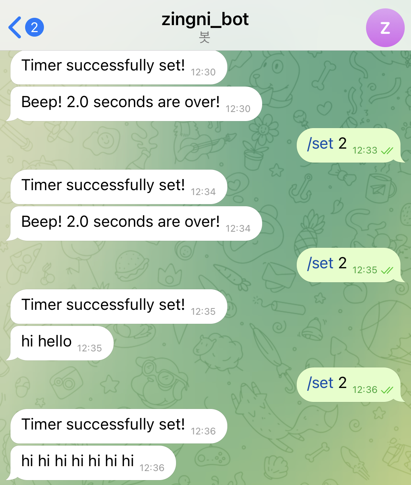

#  Telegram Timer Camera Bot

라즈베리파이와 파이썬을 활용해 **주기적으로 사진을 촬영**하고, 촬영한 사진과 원하는 메시지를 **텔레그램 봇으로 전송** 하는 프로그램 실습
 

## 사용 기술
- Telegram Bot API
- Raspberry Pi (카메라 모듈 사용)  
- `python-telegram-bot` 라이브러리
- `opencv-python (cv2)` 라이브러리
 

## 예시

 

